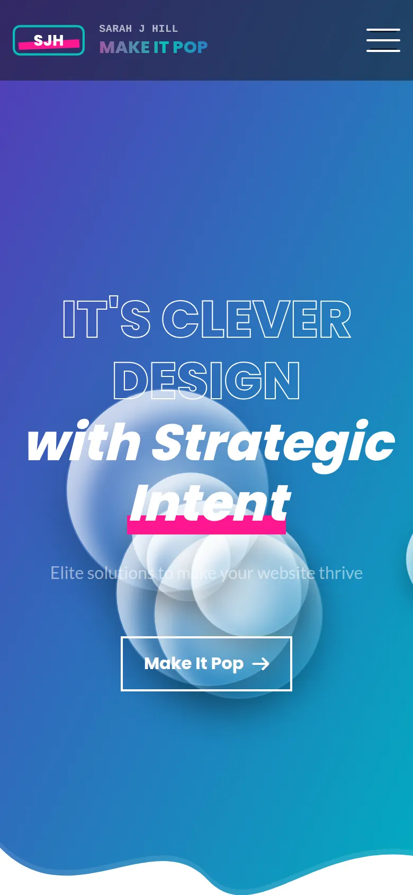
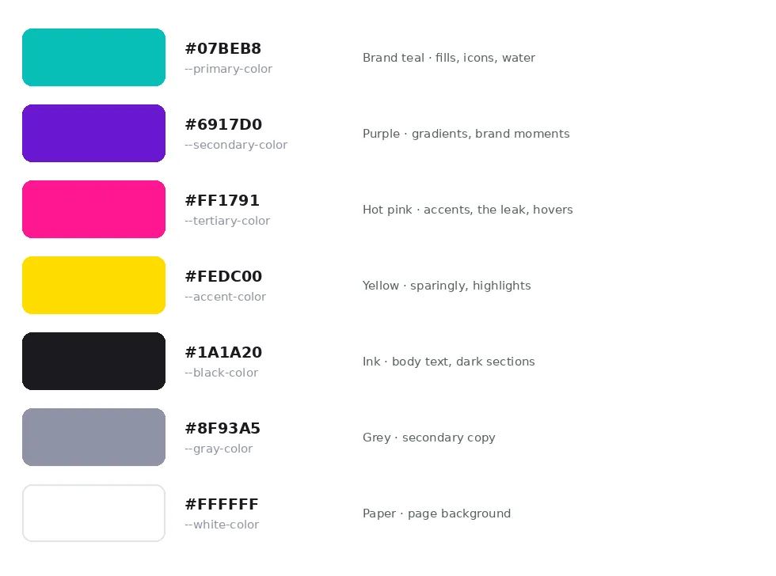
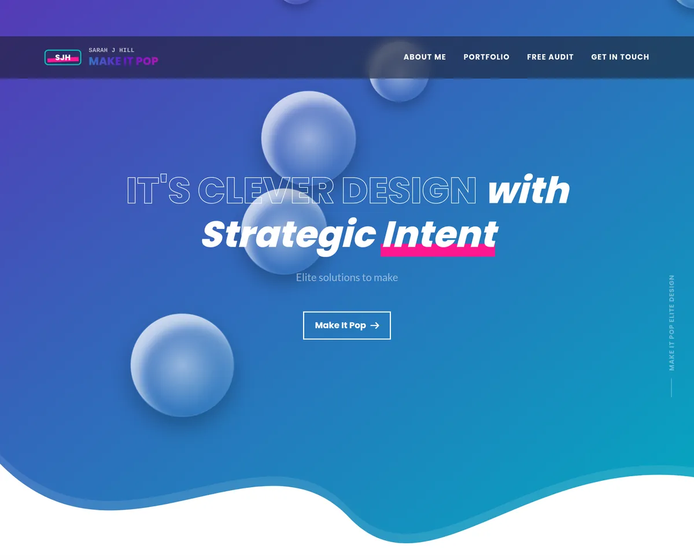
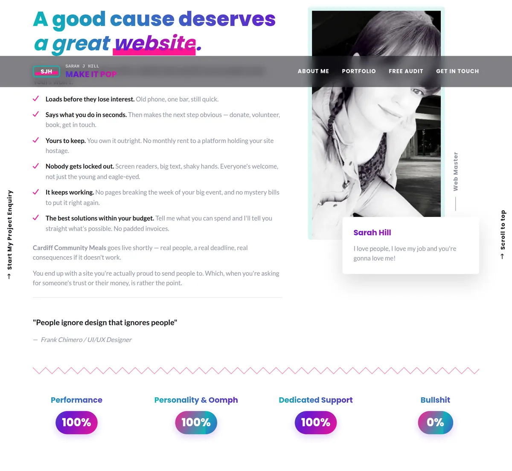
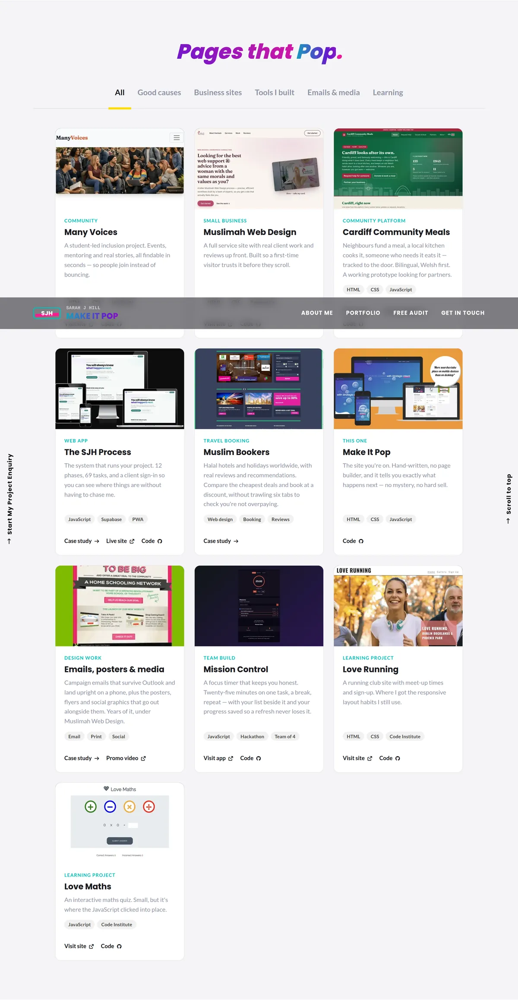
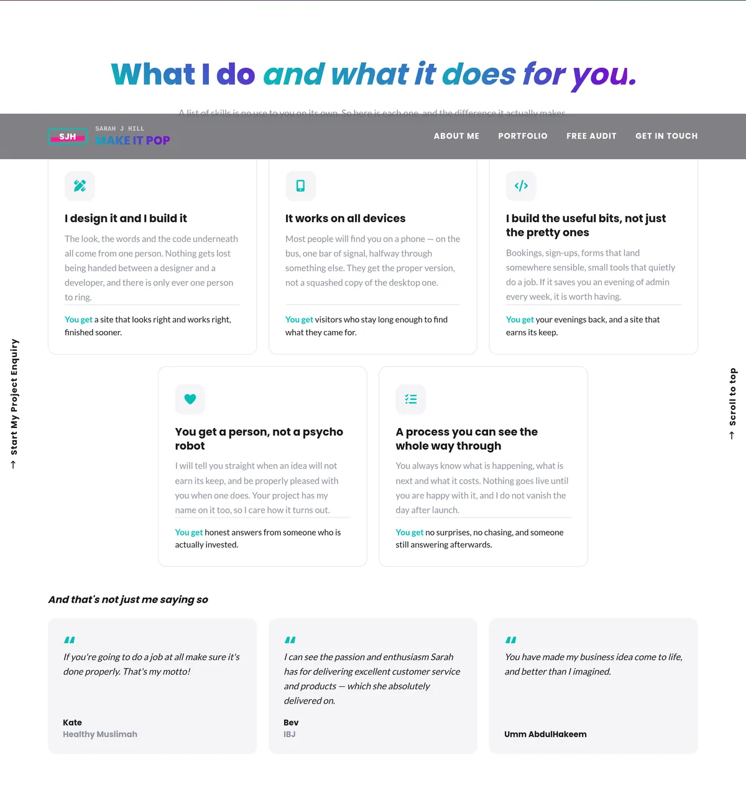
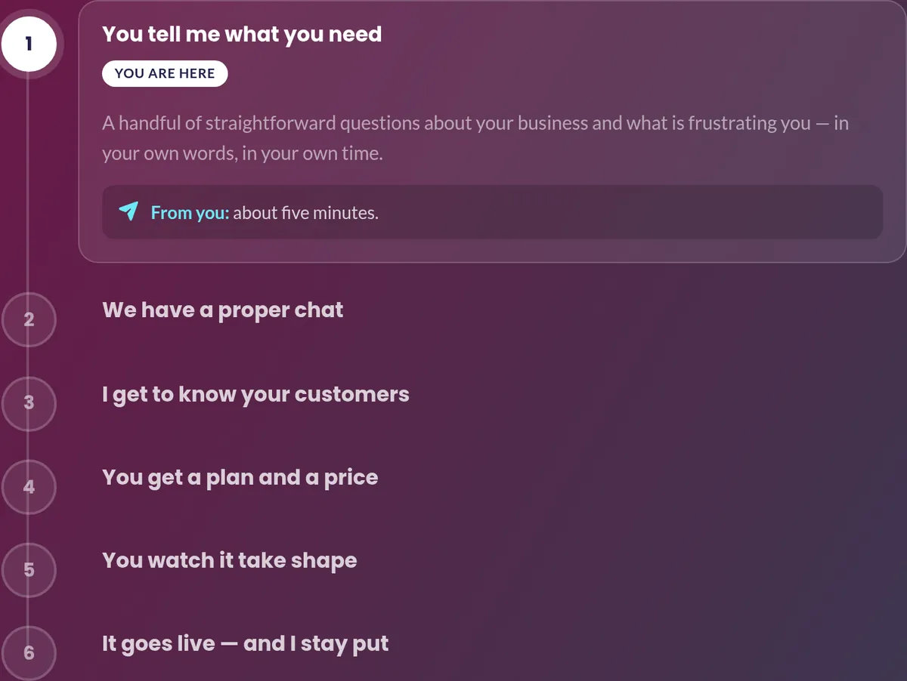
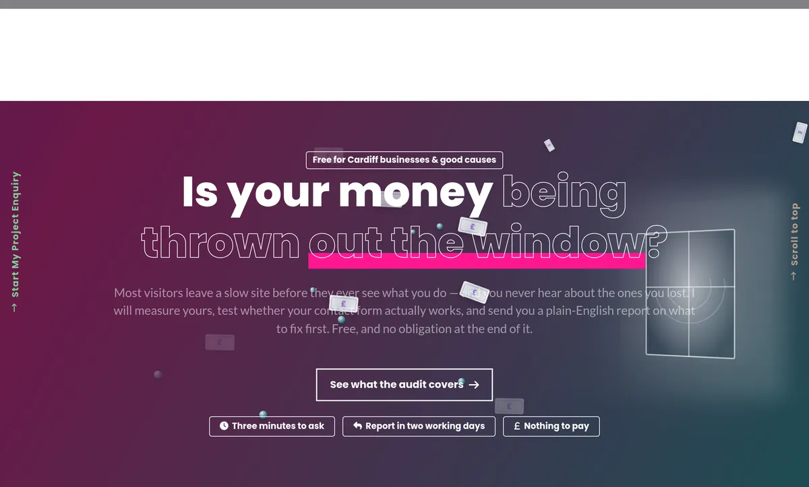
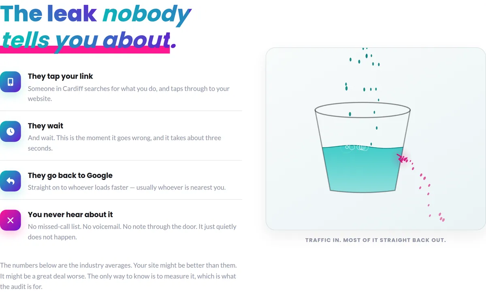
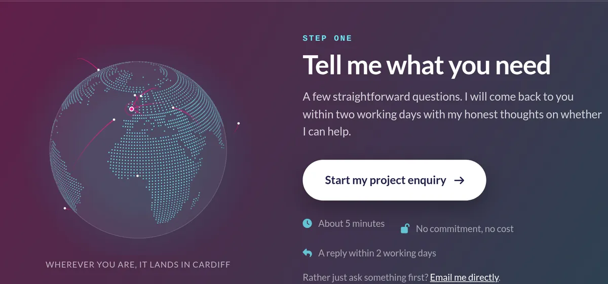

# [make-it-pop](https://sarahjhill.com)

Developer: Sarah Hill ([sarahjhill](https://www.github.com/sarahjhill))

[](https://www.github.com/sarahjhill/make-it-pop/commits/main)
[](https://www.github.com/sarahjhill/make-it-pop/commits/main)
[](https://www.github.com/sarahjhill/make-it-pop)
[](https://sarahjhill.com)

# Make It Pop — websites for community projects, charities and small local businesses

Make It Pop is the public site for **Sarah J Hill**. It exists to do one job: turn a stranger who has never heard of me into an enquiry, without either of us wasting the other's time.

Most people who need a website built are not short of options — they are short of a way to tell the options apart. Every agency site says the same things. So this one does the opposite of a brochure: it shows the actual process, step by step, says out loud what each stage costs you in time, and offers a free audit so nobody has to commit to anything to find out whether I can help.

The people I build for are community projects, charities and small local businesses. That audience shapes every technical decision on this site. They are usually on a phone, often on a poor connection, and frequently older or using assistive technology. So the site is hand-built with no build step, no framework and no page builder — one dependency-free script replaces around twenty vendor libraries, the icon font is a 30-glyph subset instead of the full 924KB Font Awesome, and every animation stops dead if the visitor has asked for reduced motion.

**Site Mockups**
*([amiresponsive](https://ui.dev/amiresponsive?url=https://sarahjhill.com))*



## UX

The site is built around one honest observation: people do not read marketing copy, they scan for reasons to leave. So every section is designed to answer the objection a visitor is holding at that moment, in the order they hold it.

#### 1. Strategy

**Purpose**
- Turn an anonymous visitor into a project enquiry through the intake form.
- Prove competence with real, live work rather than adjectives.
- Offer a free website audit as a low-commitment way in for anyone not ready to buy.
- Be openly specific about process, timescales and what is expected from the client — because vagueness is what people have been burned by before.

**Primary User Needs**
- Understand what I do within a few seconds of landing.
- See work I have actually shipped, running, not a mockup.
- Know roughly what happens next and what it will cost them in effort.
- Reach a real person rather than a contact form that disappears.

**Business Goals**
- Generate qualified enquiries with enough detail to quote against.
- Establish **The SJH Process** as the thing that makes me different from a cheaper freelancer.
- Use the free audit to start conversations with people who are not yet ready to commit.
- Rank for local, human searches rather than generic agency terms.

#### 2. Scope

**[Features](#features)** (see below)

**Content Requirements**
- A hero that states what I do and who for, in one sentence.
- An about section that leads with benefits to the client, not a CV.
- A portfolio where every piece links to the live site, not a screenshot.
- A plain-English breakdown of the six-step process, including what the client has to do at each stage.
- A free audit offer with its own page and its own form.
- A contact route that makes it obvious a person is on the other end.

#### 3. Structure

**Information Architecture**
- **Navigation**: About Me · Portfolio · Free Audit · Say Hello — four items, no dropdowns, all reachable in one click.
- **Hierarchy**:
  - One primary action per section, repeated down the page.
  - Portfolio placed early, because proof beats claims.
  - The process shown as a rail that plays itself, so the whole shape is visible without reading.
  - The enquiry form as the single destination every path leads to.

**Pages**
| Page | Purpose |
| --- | --- |
| `index.html` | Home — hero, about, portfolio, what I do, process, contact |
| `website-audit.html` | The free audit offer and what it covers |
| `project-os.html` | Case study — The SJH Process |
| `cardiff-community-meals.html` | Case study — Cardiff Community Meals |
| `emails-media.html` | Archive of email and media design work |
| `portfolio-project.html` | Reusable case-study template for future work |

**User Flow**
1. Visitor lands on the home page and reads what I do in one sentence.
2. Scrolls to the portfolio and hovers a card — the real site loads and scrolls itself inside the tile.
3. Reads "What I do" and the benefit attached to each skill.
4. Watches the process rail play through the six steps.
5. Reaches the closing call to action and starts the project enquiry — or takes the free audit instead if they are not ready.

#### 4. Skeleton

The layout was iterated directly in the browser rather than wireframed on paper, which is how a hand-built site with no design handoff tends to go. The responsive behaviour was checked continuously in Chrome DevTools and against [amiresponsive](https://ui.dev/amiresponsive?url=https://sarahjhill.com).

#### 5. Surface

**Visual Design Elements**
- **[Colours](#colour-scheme)** (see below)
- **[Typography](#typography)** (see below)

### Colour Scheme



The palette is deliberately loud, and that is the point. Sites in this space default to a safe corporate blue, which is exactly why they all blend together. A designer's own site is the one place where playing it safe is the wrong call — if I cannot make my own site stand out, there is no reason to believe I can make yours.

The rule is that each colour has one job and keeps it:

- `#07beb8` — brand teal. Fills, icons, the water in the leak animation.
- `#6917d0` — purple. Gradients and brand moments only.
- `#ff1791` — hot pink. Accents, hovers, and anything that represents loss.
- `#fedc00` — yellow. Used very sparingly, for highlights.
- `#1a1a20` — ink. Body text and dark sections.
- `#8f93a5` — grey. Secondary copy.
- `#ffffff` — paper. Page background.

One deliberate exception is documented in the CSS: the bright brand teal only reaches about **2.3:1** on white, which is fine for a logo tile or a body of water but fails as text. So anywhere teal has to be readable — link text, small labels, the falling drops in the leak animation — it drops to a darkened `#08807c` at roughly 4.8:1. Bright teal for fills, dark teal for anything you have to read.

### Typography

- [Display — Poppins](https://fonts.google.com/specimen/Poppins) — a geometric sans with enough personality to carry the loud palette without tipping into novelty. Used at 700 and 800 for headings and the wordmark.
- [Body — Lato](https://fonts.google.com/specimen/Lato) — a humanist sans that stays legible at small sizes and in long paragraphs, and does not fight Poppins.
- **Utility — Courier New** — used only for the brand tag line, eyebrows and metadata. The monospace rhythm marks those elements as labels at a glance.
- Icons are a **30-glyph subset of [Font Awesome 6 Free](https://fontawesome.com)**, generated from the full package and cut down to only the icons this site actually uses: 4.7KB of font files instead of 924KB. Subsetting is permitted under the SIL OFL — see [THIRD-PARTY-NOTICES.md](THIRD-PARTY-NOTICES.md).

## Responsiveness

[Bootstrap](https://getbootstrap.com/) provides the grid; everything else is custom CSS scoped so it cannot leak into the vendor styles. Breakpoints follow Bootstrap's at 576px, 768px and 992px, with extra handling at 420px for the header.

Two responsive decisions worth calling out, because they are about behaviour rather than layout:

- **Hover effects are gated behind `@media (hover: hover) and (pointer: fine)`.** On a touch screen `:hover` sticks after a tap, so an ungated hover state leaves a card looking permanently pressed. Gating it means phones simply never enter that state.
- **The portfolio's live previews are opt-in on touch.** On a desktop, hovering a card loads the real site in a frame and scrolls it. On a phone that would mean eight live iframes arriving unasked, which would flatly contradict the promise this site makes about loading fast on a bad connection — so touch devices get a "See it live" button and nothing loads until it is pressed.


## User Stories

**1. Charity trustee with no technical background**
As a trustee looking for someone to rebuild our site, I want to understand what I am buying without wading through jargon, so that I can take a recommendation back to the board.
*Acceptance criteria:* the hero states the offer in one sentence; the process is visible without clicking; every step says what is required from the client.

**2. Community organiser on a tight budget**
As someone running a project on almost no money, I want to know early whether I can afford this, so that I do not waste an hour finding out I cannot.
*Acceptance criteria:* the enquiry form asks for a budget band with an "I genuinely do not know yet" option; the copy states plainly that I will say if I am not the right person.

**3. Small business owner who has been burned before**
As someone who paid for a site that was never finished, I want evidence that this will be different, so that I can trust the process.
*Acceptance criteria:* the portfolio links to live, working sites; the process names what happens at each stage and what it costs in time; the site says I stay available for a month after launch.

**4. Visitor on an old phone with one bar of signal**
As someone browsing on a poor connection, I want the page to load before I lose patience, so that I actually see what is on offer.
*Acceptance criteria:* no render-blocking JavaScript; images are WebP with explicit dimensions; the icon font is a subset; no live previews load unless requested.

**5. Someone not ready to commit**
As a visitor who is curious but not ready to hire anyone, I want a way to get something useful without a sales conversation, so that I can decide in my own time.
*Acceptance criteria:* the free audit has its own page and its own form; it is reachable from the main navigation; the copy states it costs nothing and commits you to nothing.

## Features

**Header and navigation** — the SJH mark, the name above the wordmark, and four links. The bar is translucent with a backdrop blur so the hero shows through it.

**Hero** — the offer in one line, with an animated gradient and a typed strapline that cycles through three promises.



**About** — leads with what the client gets rather than a biography: loads quickly, says what you do in seconds, yours to keep, nobody gets locked out, keeps working, best solution within your budget.



**Portfolio with live previews** — the distinctive one. Every card carries a still screenshot, and on a desktop hovering it loads the **real site** in a frame that slowly scrolls itself, so you see the whole page without leaving. Only one frame is ever alive at a time, the frame can never take the mouse wheel, and the site is checked for reachability before it is framed — if it does not answer, the card quietly keeps its photograph rather than showing a broken grey rectangle.



**What I do** — five skills, each paired with the concrete thing the client gets out of it.



**The process rail** — six steps in a single column that plays through on its own, filling teal to pink as it advances. It pauses on hover or focus and stops for good once someone chooses a step themselves. Without JavaScript every step is simply open, so nothing is ever trapped behind an interaction.



**Free audit call to action** — a full-width band with an animation of money going out of the window, linking to the audit page.



**The leak** *(audit page)* — the loss explained as four steps, with a canvas animation beside it: visitors pour into a bucket and most of them leave through a crack in the side. The level never rises, which is the whole idea.



**Contact globe** — the closing call to action. Messages arc in from eighteen cities around a dot globe and land on Cardiff. The continents are a 2° land mask packed one bit per cell — about 2KB for the whole world, sharper than an image at any size. The globe sways rather than spins, so Cardiff and the arcs landing on it never rotate out of sight.



### Future Features

- **Client portal integration** — link the enquiry form directly into [The SJH Process](https://sarahjhill.github.io/project-os/) so a new enquiry creates its project automatically.
- **Case study filtering by sector** — let charities see charity work first.
- **Welsh language version** — most of the audience is in Cardiff, and the Cardiff Community Meals project is already bilingual.
- **Published audit results** — anonymised before-and-after numbers from real audits, as proof the audit is worth having.

## Tools & Technologies

| Tool / Tech | Use |
| --- | --- |
| [](https://en.wikipedia.org/wiki/HTML) | Main site content and layout. |
| [](https://en.wikipedia.org/wiki/CSS) | Design, layout and all animation timing. |
| [](https://www.javascript.com) | One dependency-free script replacing around twenty vendor libraries. |
| [](https://getbootstrap.com) | Grid and a small set of base components. |
| [](https://fontawesome.com) | Icons, subset to the 30 actually used. |
| [](https://fonts.google.com) | Poppins and Lato, loaded without blocking first paint. |
| [](https://git-scm.com) | Version control. |
| [](https://github.com) | Code hosting. |
| [](https://github.com/features/actions) | Builds and deploys the site on every push to `main`. |
| [](https://pages.github.com) | Hosting. |
| [](https://www.cloudflare.com) | Registrar, DNS and email routing for `sarahjhill.com`. |
| [](https://formspree.io) | Form handling for the enquiry and audit forms. |
| [](https://code.visualstudio.com) | Local IDE. |
| [](https://developers.google.com/speed/webp) | Every raster image on the site. |
| [](https://claude.ai) | Pair programming, code review, and building the canvas animations. |

## Agile Development Process

### GitHub Projects

[GitHub Projects](https://www.github.com/sarahjhill/make-it-pop/projects) was used as the Agile tool for this build. EPICs, User Stories and bugs were planned there and tracked on a Kanban board.

### GitHub Issues

[GitHub Issues](https://www.github.com/sarahjhill/make-it-pop/issues) tracked User Stories, tasks and any bugs found during testing.

### MoSCoW Prioritization

Epics were decomposed into User Stories and labelled in the Issues tab:

- **Must Have**: guaranteed to be delivered — the site does not ship without them (*max ~60% of stories*)
- **Should Have**: adds significant value, but not vital (*~20% of stories*)
- **Could Have**: small impact if left out (*the rest ~20% of stories*)
- **Won't Have**: not a priority for this iteration — see [Future Features](#future-features)

## Testing

### HTML validation

Validated with [html-validate](https://html-validate.org) against the recommended ruleset, run across all six pages.

The first run found **22 errors**, all of which were fixed:

| Issue | Count | Fix |
| --- | --- | --- |
| `<button>` without an explicit `type` | 18 | Added `type="button"` — without it a button inside a form defaults to `submit`. |
| `<span>` as a direct child of `<ol>` | 2 | Moved the process rail's track and fill onto a wrapper; only `<li>` is valid inside a list. |
| Raw `&` in text content | 1 | Encoded as `&amp;`. |
| `` | 1 | An empty `src` makes the browser re-request the page. Replaced with a 1×1 transparent placeholder that the lightbox script overwrites. |

All six pages now pass with **0 errors and 0 warnings**.

The same pages can be checked against the W3C service: [validator.w3.org](https://validator.w3.org/nu/?doc=https%3A%2F%2Fsarahjhill.com).

### CSS validation

Run against the [W3C CSS validator](https://jigsaw.w3.org/css-validator/validator?uri=https%3A%2F%2Fsarahjhill.com).

*(Add the result screenshot to `documentation/images/css-validation.webp`.)*

### Lighthouse

Run in Chrome DevTools on both mobile and desktop profiles.

*(Add the result screenshot to `documentation/images/lighthouse-testing.webp`.)*

### Accessibility

These are built in rather than tested for afterwards:

- Every interactive element is reachable and operable by keyboard, including the process rail (arrow keys, Home and End).
- All animation — the globe, the leak, the process rail, the scroll reveals — is disabled under `prefers-reduced-motion: reduce`, and each falls back to a sensible still state rather than nothing.
- The process rail's step content is present and open in the HTML and only collapses once JavaScript runs, so nothing is hidden from a visitor without it.
- Decorative canvases are `aria-hidden`; the meaning is always carried by adjacent text.
- Colour contrast was checked against WCAG AA, and the bright brand teal is deliberately swapped for a darker variant anywhere it has to be read.

### Manual testing

| Test | Result |
| --- | --- |
| Navigation links jump to the correct sections | Pass |
| Process rail plays, pauses on hover, and stops on click | Pass |
| Portfolio previews load on hover and never steal the page scroll | Pass |
| Portfolio previews do not load on touch until "See it live" is tapped | Pass |
| Enquiry and audit forms submit to Formspree | Pass |
| Layout holds from 320px to 1920px | Pass |
| All 30 icons render | Pass |

## Deployment

### GitHub Pages

The site is deployed to GitHub Pages by a GitHub Actions workflow (`.github/workflows/static.yml`), which runs on every push to `main` and publishes the repository root.

- In the [GitHub repository](https://www.github.com/sarahjhill/make-it-pop), navigate to the "Settings" tab.
- Click "Pages" in the left-hand menu.
- Under "Build and deployment", set **Source** to **GitHub Actions**.
- Push to `main`; the workflow runs and the site is live within a minute or two.

### Custom domain

The site is served from **[sarahjhill.com](https://sarahjhill.com)**.

- A `CNAME` file in the repository root contains the domain. Because the site is published by Actions rather than from a branch, GitHub does not create this file automatically — it has to be committed.
- DNS is managed at Cloudflare: four `A` records and four `AAAA` records on the apex pointing at GitHub Pages, plus a `CNAME` for `www`.
- Those records are set to **DNS only** rather than proxied. With Cloudflare's proxy enabled, GitHub cannot complete its certificate challenge and HTTPS fails.
- "Enforce HTTPS" is enabled in the repository's Pages settings.

The live link: [sarahjhill.com](https://sarahjhill.com)

### Local Development

This project can be cloned or forked to make a local copy on your own system. There is no build step and no dependencies to install.

#### Cloning

1. Go to the [GitHub repository](https://www.github.com/sarahjhill/make-it-pop).
2. Click the green "Code" button above the file list.
3. Choose "HTTPS", "SSH" or "GitHub CLI" and copy the URL.
4. Open your terminal and change to the directory where you want the clone.
5. Run:
	- `git clone https://www.github.com/sarahjhill/make-it-pop.git`
6. Press Enter to create your local clone.

Then either open `index.html` directly in a browser, or serve it so relative paths behave exactly as they do in production:

```bash
python3 -m http.server 8000
```

#### Forking

1. Log in to GitHub and open the [repository](https://www.github.com/sarahjhill/make-it-pop).
2. Click the "Fork" button at the top right.
3. You now have a copy in your own account to change without affecting the original.

### Local VS Deployment

There are no functional differences between the local and deployed versions. Two things only work fully once deployed:

- The portfolio's live previews frame sites over HTTPS, so they need the page itself served over HTTP or HTTPS rather than opened from `file://`.
- Form submissions go to Formspree, which requires a real origin.

Favicons and stylesheets cache aggressively — hard refresh (`Cmd`/`Ctrl` + `Shift` + `R`) or use a private window when checking changes. Asset links carry a `?v=` query string that is bumped whenever CSS or JavaScript changes, to force browsers past their cache.

## Credits

### Content

All site copy was written by me. [Claude](https://claude.ai) was used as a writing and editing partner, and for building and reviewing the canvas animations.

| Source | Notes |
| --- | --- |
| [Bootstrap 5.3](https://getbootstrap.com/docs/5.3/getting-started/introduction/) | Grid and base components. |
| [Font Awesome Free 6](https://fontawesome.com) | Icons — subset under the SIL OFL, see [THIRD-PARTY-NOTICES.md](THIRD-PARTY-NOTICES.md). |
| [world-atlas](https://github.com/topojson/world-atlas) | Source data for the contact globe's land mask. |
| [Chris Beams](https://chris.beams.io/posts/git-commit) | "How to Write a Git Commit Message". |
| [Code Institute](https://codeinstitute.net) | Project structure and README conventions. |
| [Claude](https://claude.ai) | Code logic, animation maths, and explanations. |

### Media

- Photography and portfolio screenshots — my own, captured from the live sites.
- Image compression — [WebP](https://developers.google.com/speed/webp), with explicit `width` and `height` on every image to prevent layout shift.
- The logo, favicon and icon set are my own work. The letterforms are outlined from Poppins so the mark renders identically with no font available.

### Acknowledgements

- Thank you to [Code Institute](https://codeinstitute.net/) for teaching the building process, and to the mentors for their support.
- I would like to thank my Code Institute mentor, [Tim Nelson](https://www.github.com/TravelTimN), for the support throughout.
- I would like to thank the [Code Institute](https://codeinstitute.net) Tutor Team for their help with troubleshooting and debugging.
- I would also like to thank the [Code Institute Discord community](https://discord-portal.codeinstitute.net) for the moral support through periods of self-doubt and impostor syndrome.
- I would like to thank my partner, for believing in me and for the many great ideas that pushed me to make this transition into software development.

---

**Copyright © 2026 Sarah Hill. All rights reserved.** See [LICENSE](LICENSE).

The original content, copy, custom CSS, JavaScript and branding in this repository are not licensed for reuse. Third-party components carry their own licences — see [THIRD-PARTY-NOTICES.md](THIRD-PARTY-NOTICES.md).
